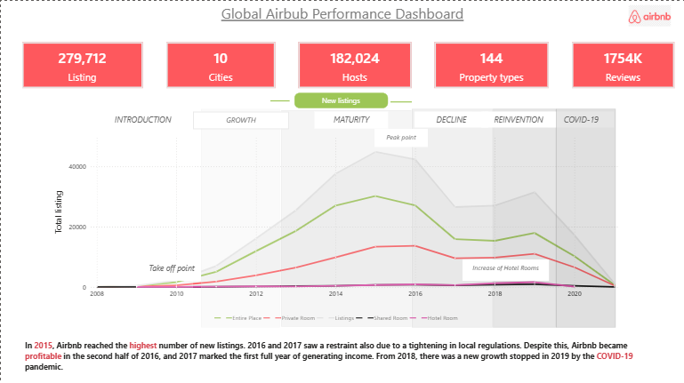
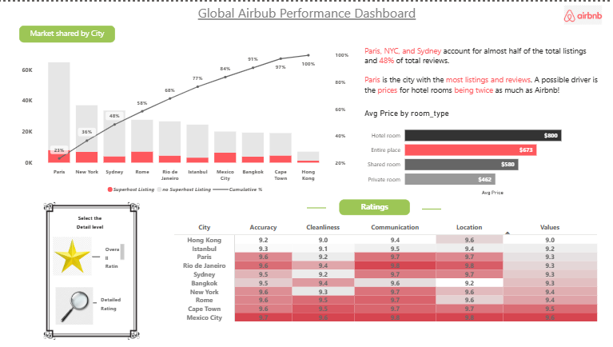
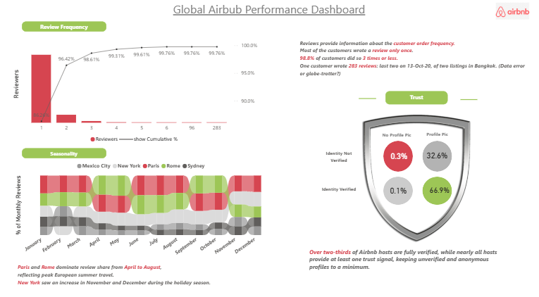

# 🏡 Airbnb Power BI Dashboard

## 📊 Overview
This project presents an interactive Power BI dashboard analyzing Airbnb data to uncover insights on customer behavior, host verification, and seasonal trends.

---

## 📌 Key Insights

- Most customers wrote a review only once  
- 98.8% of customers wrote 3 reviews or less  
- Over two-thirds of hosts are fully verified  
- Paris and Rome dominate review share from April to August  
- New York shows peak activity during the holiday season  

---

## Dashboard Preview

### Overview

### Ratings

### Reviews

---

## 📂 Download Dashboard

👉 [Download Power BI File](https://drive.google.com/file/d/1eBDbGhgfZPrIV6spUYU97l2sdvkzXLdf/view?usp=drive_link)

---

## 👤 Author
Vaishnavi Patil
